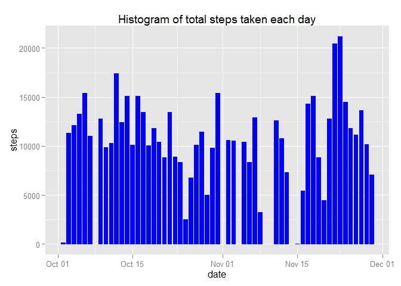
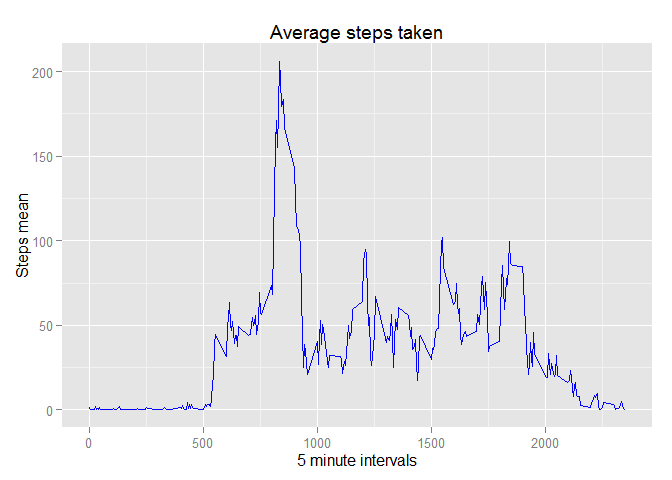
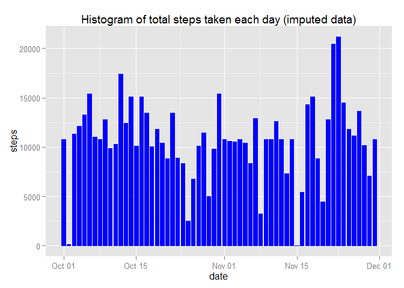
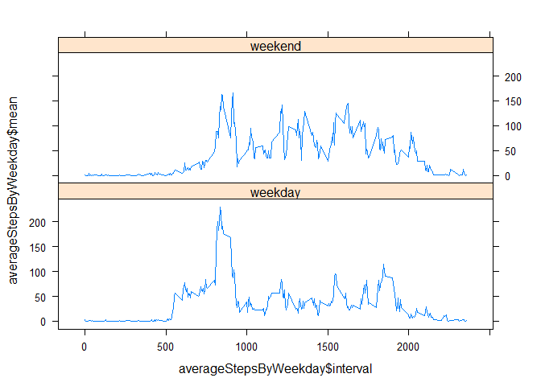

# Reproducible Research: Peer Assessment 1
Gary Lucas  
November 15, 2015  
## basic settings

```r
echo = TRUE 
library(ggplot2)
```


## Loading and preprocessing the data

```r
unzip("activity.zip")
activityDataRaw <- read.csv("activity.csv", colClasses = c("integer", "Date","factor" ))
dim(activityDataRaw)
```

```
## [1] 17568     3
```

```r
activityDataNoNA <- na.omit(activityDataRaw)
dim(activityDataNoNA)
```

```
## [1] 15264     3
```

## What is mean total number of steps taken per day?
### make a histogram of the total number of steps taken each day

```r
ggplot(activityDataNoNA, aes( date, steps)) + geom_bar(stat="identity", color="blue", fill="blue", width=0.75) + labs(title="Histogram of total steps taken each day")
```

 
### Calculate the total number of steps taken each day

```r
totalSteps <- aggregate(activityDataNoNA$steps, by=list(date=activityDataNoNA$date), FUN="sum")$x
mean(totalSteps)
```

```
## [1] 10766.19
```

```r
median(totalSteps)
```

```
## [1] 10765
```

## What is the average daily activity pattern?
### Make a time series plot (i.e. type = "l") of the 5-minute interval (x-axis) and the average number of steps taken, averaged across all days (y-axis)


```r
averageSteps <- aggregate(activityDataNoNA$steps, by=list(interval=as.numeric(as.character(activityDataNoNA$interval))), FUN="mean")
names(averageSteps)[2] <- "stepsMean"
ggplot(averageSteps, aes(interval, stepsMean)) + geom_line(color= "blue") + labs(title="Average steps taken", x="5 minute intervals", y="Steps mean")
```

 

### Which 5-minute interval, on average across all the days in the dataset, contains the maximum number of steps?

```r
averageSteps[averageSteps$stepsMean == max(averageSteps$stepsMean), ]
```

```
##     interval stepsMean
## 104      835  206.1698
```


## Imputing missing values
### Calculate and report the total number of missing values in the dataset (i.e. the total number of rows with NAs)

```r
sum(is.na(activityDataRaw))
```

```
## [1] 2304
```
### Devise a strategy for filling in all of the missing values in the dataset. The strategy does not need to be sophisticated. For example, you could use the mean/median for that day, or the mean for that 5-minute interval, etc.

I've decided to replace the NA's with the average of the other non-na values for that step interval.  I tried to do this with a more functional aproach but couldn't puzzle it out and ended up doing it in a loop

### Create a new dataset that is equal to the original dataset but with the missing data filled in.

```r
activityDataImputed <- activityDataRaw 
for (i in 1:nrow(activityDataImputed)) {
    if (is.na(activityDataImputed$steps[i])) {
        activityDataImputed$steps[i] <- averageSteps[which(activityDataImputed$interval[i] == averageSteps$interval), ]$stepsMean
    }
}

sum(is.na(activityDataImputed))
```

```
## [1] 0
```
### Make a histogram of the total number of steps taken each day and Calculate and report the mean and median total number of steps taken per day. Do these values differ from the estimates from the first part of the assignment? What is the impact of imputing missing data on the estimates of the total daily number of steps?

```r
ggplot(activityDataImputed, aes( date, steps)) + geom_bar(stat="identity", color="blue", fill="blue", width=0.75) + labs(title="Histogram of total steps taken each day (imputed data)")
```

 

```r
totalStepsImputed <- aggregate(activityDataImputed$steps, by=list(date=activityDataImputed$date), FUN="sum")$x
mean(totalStepsImputed)
```

```
## [1] 10766.19
```

```r
median(totalStepsImputed)
```

```
## [1] 10766.19
```

```r
meanWithNA <- mean(totalSteps)
medianWithNA <- median(totalSteps)

meanImputed <- mean(totalStepsImputed)
medianImputed <- median(totalStepsImputed)

meanDifference <- meanWithNA - meanImputed
medianDifference <- medianWithNA - medianImputed
```
The difference between the mean steps value of the imputed data set vs the raw dataset is: 0

The difference between the median steps value of the imputed data set vs the raw dataset is: -1.1886792


## Are there differences in activity patterns between weekdays and weekends?
* Create a new factor variable in the dataset with two levels – “weekday” and “weekend” indicating whether a given date is a weekday or weekend day.


```r
weekdayActivityData <- activityDataImputed
weekdayActivityData$Weekday <- factor(weekdays(weekdayActivityData$date))
weekdays <- factor(c("Monday", "Tuesday", "Wednesday", "Thursday", "Friday"))
weekends <- factor(c("Saturday", "Sunday"))
weekdayActivityData$dayType[weekdayActivityData$Weekday %in% weekdays] <- "weekday"
weekdayActivityData$dayType[weekdayActivityData$Weekday %in% weekends] <- "weekend"
weekdayActivityData$dayType <- factor(weekdayActivityData$dayType)

head(weekdayActivityData)
```

```
##       steps       date interval Weekday dayType
## 1 1.7169811 2012-10-01        0  Monday weekday
## 2 0.3396226 2012-10-01        5  Monday weekday
## 3 0.1320755 2012-10-01       10  Monday weekday
## 4 0.1509434 2012-10-01       15  Monday weekday
## 5 0.0754717 2012-10-01       20  Monday weekday
## 6 2.0943396 2012-10-01       25  Monday weekday
```

* Make a panel plot containing a time series plot (i.e. type = "l") of the 5-minute interval (x-axis) and the average number of steps taken, averaged across all weekday days or weekend days (y-axis). See the README file in the GitHub repository to see an example of what this plot should look like using simulated data.


```r
library(lattice)
averageStepsByWeekday <- 
  aggregate(weekdayActivityData$steps, 
            by = list(interval = as.numeric(as.character(weekdayActivityData$interval)) ,
                      weekday = weekdayActivityData$dayType), 
            FUN = "mean")

names(averageStepsByWeekday)[3] <- "mean"

head(averageStepsByWeekday)
```

```
##   interval weekday       mean
## 1        0 weekday 2.25115304
## 2        5 weekday 0.44528302
## 3       10 weekday 0.17316562
## 4       15 weekday 0.19790356
## 5       20 weekday 0.09895178
## 6       25 weekday 1.59035639
```

```r
xyplot(averageStepsByWeekday$mean ~ averageStepsByWeekday$interval | averageStepsByWeekday$weekday, layout = c(1,2), type="l")
```

 

xyplot(averageStepsByWeekday$mean ~ averageStepsByWeekday$interval | averageStepsByWeekday$weekday, layout = c(1,2), type="l")
